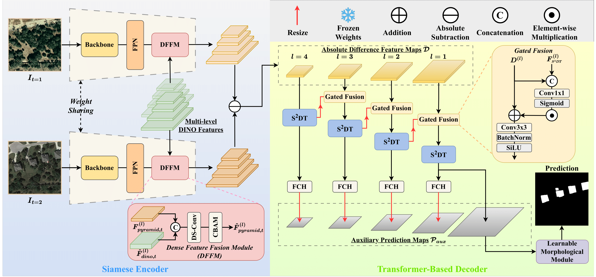
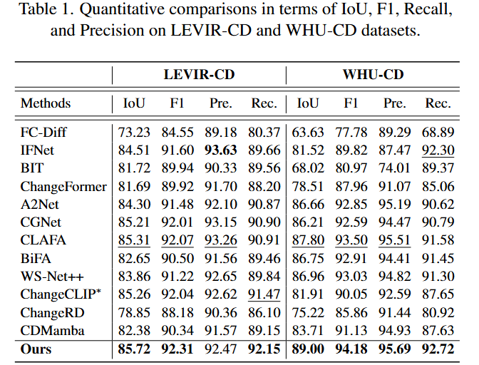
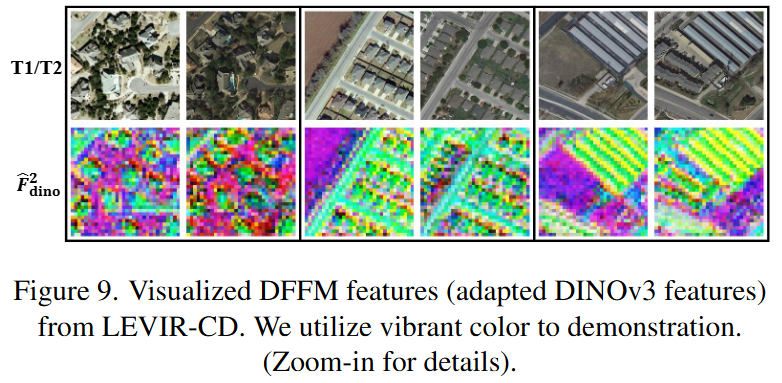

[[paper]](https://arxiv.org/pdf/2411.15922)
# ChangeDINO
Arch.
<center></center>

# Quick Guide

## Setup
Recommended: Python 3.10, PyTorch 2.4.0 (CUDA 11.8)
```bash
cd ChangeDINO
conda create -n changedino python=3.10
conda activate changedino
# recommendation (torch <= 2.4.0 and cuda <= 12.1 for mmcv installation)
pip install torch==2.4.0 torchvision==0.19.0 torchaudio==2.4.0 --index-url https://download.pytorch.org/whl/cu118
# mmcv need to fit torch and cuda version
pip install mmcv==2.2.0 -f https://download.openmmlab.com/mmcv/dist/cu118/torch2.4/index.html
pip install -r requirements.txt
```

## Dataset
Place all datasets under `--dataroot` (ex. `/path/to/CD-Dataset`). 

Expect the data structure:
```
/path/to/CD-Dataset/
└── WHU-CD/                      # matches --dataset
    ├── train/
    │   ├── A/                   # T1 images (pre-change)
    │   ├── B/                   # T2 images (post-change)
    │   └── label/               # binary masks (0 or 255 / 0 or 1)
    ├── val/
    │   ├── A/
    │   ├── B/
    │   └── label/
    └── test/
        ├── A/
        ├── B/
        └── label/
```
## Train / Validate
```bash
cd dinov3/ChangeDINO
python trainval.py \
  --name WHU-ChangeDINO \
  --dataset WHU-CD \
  --dataroot /path/to/CD-Dataset \
  --gpu_ids 0 \
  --batch_size 16 \
  --num_epochs 100 \
  --lr 5e-4
```
Important flags live in `option.py` (datasets, GPUs, checkpoints, backbone/FPN choices, learning rate, etc.). Results are saved to `checkpoints/<name>`; the best checkpoint is `<name>_<backbone>_best.pth`.

## Test
```bash
python test.py \
  --name WHU-ChangeDINO \
  --dataset WHU-CD \
  --dataroot /path/to/CD-Dataset \
  --gpu_ids 0 \
  --save_test
```
This loads the best checkpoint, runs on the `test` split, prints metrics, and saves predictions (if `--save_test`) under `checkpoints/<name>/pred/`.

Adjust `--gpu_ids`, `--num_workers`, and other options as needed, and use `trainval.sh` for ready-made command examples.

## Comparison
<center></center>
<center></center>
<center></center>

## Citation 

 If you use this code for your research, please cite our papers.  

```

```
